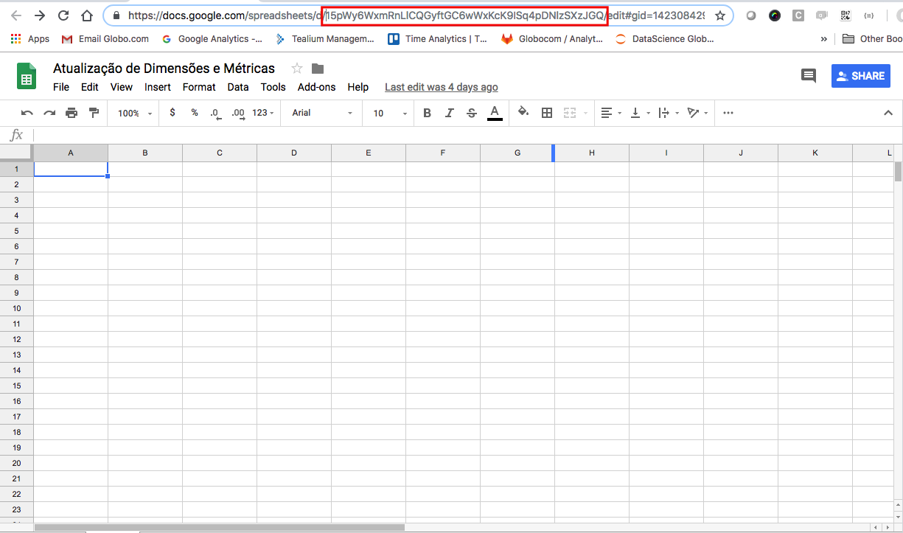

# Ga Management in Gsheet

Project Based in (https://github.com/narcan/api-tools/tree/master/GA%20Management%20Magic) - Pedro Avila (pdro@google.com)

Resource to put in Gsheet to management filters, custom dimensions and metrics.

It works with free as well and GA 360 properties.

### Installing the Add-on

#### Install clasp

Follow all instructions to install the clasp from: https://github.com/google/clasp/

#### Put all files in google script project

1. First you need to create a Gsheet file in your drive. And get the id of the file, see in image below.



2. Clone this project in your local machine.

3. Then run all these commands of clasp:

```
clasp create "ga management in gsheet" "[your gsheet id]"

clasp push

```

4. Now you authorize all the apis OAuth requisitions and use the add to manage your data in GA


## Working with Filters, Custom Dimensions & Custom Metrics in Google Sheets

#### Listing

To list filters from an account (or a list of accounts), or custom dimensions/metrics from a property (or list of properties), run one of the __List__ commands from the add-on menu. At the prompt, enter one or more account or property ID(s) -- as directed -- from which to list the management entity settings in your sheet.

Depending on whether there is data in the current sheet, the sheet will either be cleared and then formatted, or else a new sheet will be added and formatted. The resulting formatted sheet will then be populated with the values from the accounts/properties.

If you update any of these values, you can push the updates to GA by invoking one of the __Update__ functions from the add-on menu.

#### Updating

To update settings run one of the __Update__ commands from the add-on menu.

If there is no data in the sheet, or the sheet format is not recognized by the scripts, a formatted sheet will be presented, into which filter/custom dimension/metric settings can be entered.
